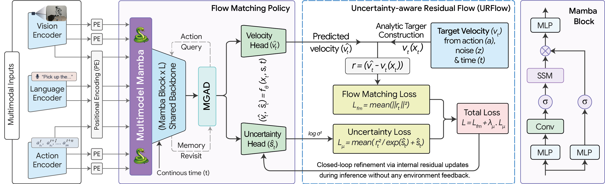

<h4 align="center"><strong><a href="https://2026.ieee-iros.org/">Accepted at IEEE/RSJ International Conference on Intelligent Robots & Systems (IROS) 2026, Pittsburgh, PA, USA</a></strong></h4>
<h2 align="center"><strong>SUREFlow: State-space Uncertainty-aware REsidual Flow Matching for Robust Robot Manipulation</a></strong></h2>
<h6 align="center">Md Tanvir Islam, Sai Navaneet Peddapalli, Sangmoon Lee, Sangtae Ahn<sup>*</sup></h6>
<h6 align="center">Kyungpook National University, Daegu 41566, Republic of Korea | *Corresponding Author</h6> 
<hr>

## SUREFlow Architecture




# SUREFlow

SUREFlow supports training on LIBERO suites and evaluating a trained checkpoint on either:
- the same vanilla LIBERO suite, or
- a LIBERO-PRO variant of that suite.

This is done by decoupling:
- **train suite**: dataset + training language embeddings
- **eval suite**: simulator benchmark + evaluation language embeddings


When `--eval_suite` is set, simulator benchmark becomes:
`<train_suite>_<eval_suite>`

Examples:
- `train_suite=libero_goal`, `eval_suite=object` -> sim benchmark `libero_goal_object`

## Training
Train on a vanilla LIBERO suite:

```bash
python run.py --train_suite libero_spatial
```
Supported `--train_suite` values: `libero_object`, `libero_spatial`, `libero_goal`, `libero_90`, `libero_10`
  
## Evaluation with a checkpoint
### 1) Vanilla LIBERO evaluation
Evaluate a checkpoint on the same vanilla suite:

```bash
python run.py --train_suite libero_spatial --checkpoint_path /path/to/ckpt.pth
```

### 2) LIBERO-PRO evaluation on the same checkpoint
Evaluate the same checkpoint on a LIBERO-PRO suite:

```bash
python run.py --train_suite libero_spatial --eval_suite object --checkpoint_path /path/to/ckpt.pth
```

#### Eval suites (LIBERO-PRO suffixes)
Optional `--eval_suite` values: `object`, `swap`, `lan`, `task`, `temp`

In this mode:
- dataset benchmark remains `libero_goal`
- simulator benchmark is `libero_goal_object`
- evaluation embeddings are loaded from `language_embeddings/libero_goal_object.pkl`


## Repository notes
The public package is `SUREFlow`. The original Mamba implementation is kept under `SUREFlow/mamba/` so the backbone code remains easy to compare with the upstream block implementation.


```bibtex
@InProceedings{sureflow2026_IROS,
    author    = {Islam, Md Tanvir and Peddapalli, Sai Navaneet and Lee, Sangmoon and Ahn, Sangtae},
    title     = {SUREFlow: State-space Uncertainty-aware REsidual Flow Matching for Robust Robot Manipulation},
    booktitle = {Proceedings of the IEEE/RSJ International Conference on Intelligent Robots & Systems (IROS)},
    month     = {September},
    year      = {2026}
}

